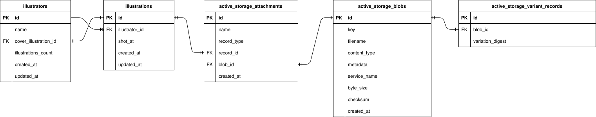

# XXX-Photos

```
 ██╗  ██╗██╗  ██╗██╗  ██╗    ██████╗ ██╗  ██╗ ██████╗ ████████╗ ██████╗ ███████╗
 ╚██╗██╔╝╚██╗██╔╝╚██╗██╔╝    ██╔══██╗██║  ██║██╔═══██╗╚══██╔══╝██╔═══██╗██╔════╝
  ╚███╔╝  ╚███╔╝  ╚███╔╝     ██████╔╝███████║██║   ██║   ██║   ██║   ██║███████╗
  ██╔██╗  ██╔██╗  ██╔██╗     ██╔═══╝ ██╔══██║██║   ██║   ██║   ██║   ██║╚════██║
 ██╔╝ ██╗██╔╝ ██╗██╔╝ ██╗    ██║     ██║  ██║╚██████╔╝   ██║   ╚██████╔╝███████║
 ╚═╝  ╚═╝╚═╝  ╚═╝╚═╝  ╚═╝    ╚═╝     ╚═╝  ╚═╝ ╚═════╝    ╚═╝    ╚═════╝ ╚══════╝
```

アルバムアプリ  

よくわからん理由での垢BAN、あと単に高い(￥)とか、、やだな～から作成  

---

## 開発用

```bash
docker compose build
```

```bash
docker compose run --rm app bundle install
```

```bash
docker compose run --rm app rails db:create
```

```bash
docker compose run --rm app rails db:migrate
```

```bash
docker compose run --rm app rails db:migrate:reset
```

```bash
docker compose up
```

```bash
docker exec -it app rails c
```

```bash
# 実行した瞬間に追記されたログだけを確認
# n: 該当ログの前 n 行含む
# m: 該当ログの後 m 行含む
tail -n 0 -f log/development.log | grep --line-buffered -B 5 -A 5 "【全バッチ完了】"
```

## テスト用

### RSpec

```bash
docker compose run --rm app rails db:migrate RAILS_ENV=test
```

```bash
docker compose run --rm app bundle exec rspec
```

テスト終了後、DBにデータを残したい場合
```ruby
# spec\rails_helper.rb
config.use_transactional_fixtures = false
```

---

## ドキュメント

### ER図



